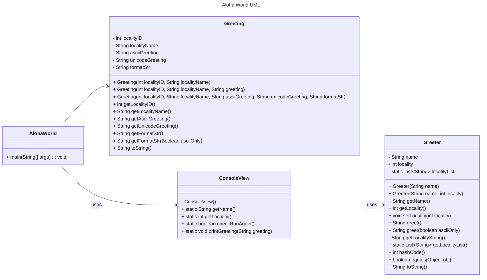

# Homework Aloha World Report

The following report contains questions you need to answer as part of your submission for the homework assignment. 

## Design Doc
Please link your UML design file here. See resources in the assignment on how to
link an image in markdown. You may also use [mermaid] class diagrams if you prefer, if so, include the mermaid code here.  You DO NOT have to include Greeting.java as part of the diagram, just the AlohaWorld application that includes: [AlohaWorld.java], [Greeter.java], and [ConsoleView.java].

### Program Flow
Write a short paragraph detailing the flow of the program in your own words. This is to help you understand / trace the code (and give you practice of something called a code walk that will be required in this course).

This program start from the AlohaWorld class. The ConsoleView class is for gathering user input by using getName() and getLocality(). And the gathered information pass to Greeter class, which creates a personalized Greeter object and generates a greeting based on the user's input. Once the greeting is generated, ConsoleView.printGreeting() is used to display it to the user. The program may then loop back to the beginning, depending on the user's response to ConsoleView.checkRunAgain().

## Assignment Questions

1. List three additional java syntax items you didn't know when reading the code.  (make sure to use * for the list items, see example below, the backtick marks are used to write code inline with markdown)
   
   * `break`
   * `catch`
   * `continue`

2. For each syntax additional item listed above, explain what it does in your own words and then link a resource where you figured out what it does in the references section. 

    * The `break` keyword in Java is used to exit a loop or switch statement prematurely. The break keyword is used to break out a for loop, a while loop or a switch block. [^1]
    * The `catch` keyword in Java is used in exception handling to handle exceptions (runtime errors) that might occur during the execution of a program. The catch keyword catches exceptions generated by try statements. The catch statement allows you to define a block of code to be executed, if an error occurs in the try block. [^2]
    * The `continue` keyword in Java is used within loops to skip the current iteration and proceed to the next iteration. The continue keyword is used to end the current iteration in a for loop (or a while loop), and continues to the next iteration. [^3]

3. What does `main` do in Java? 
   
   The `main` method is the start code while a java program starts. The JVM calls this method and to begin execution. Inside `main`, you write the logic that orchestrates the flow of the application, like creating objects, calling methods, and managing control flow.

4. What does `toString()` do in Java? Why should any object class you create have a `toString()` method?

    `toString()` is to convert value type in string type. The default implementation of toString() is not very meaningful for most user-defined classes. Overriding the toString() method allows you to provide a more informative and readable description of your object.

5. What is javadoc style commenting? What is it used for? 

   Javadoc style commenting is a special type of comment in Java used to generate documentation for classes, methods, fields, and other program elements. It helps others to understand how the program work.

6. Describe Test Driving Development (TDD) in your own words. 

   Test-Driven Development (TDD) is a software development methodology where you write tests for your code before writing the actual implementation.   

7. Go to the [Markdown Playground](MarkdownPlayground.md) and add at least 3 different markdown elements you learned about by reading the markdown resources listed in the document. Additionally you need to add a mermaid class diagram (of your choice does not have to follow the assignment. However, if you did use mermaid for the assignment, you can just copy that there). Add the elements into the markdown file, so that the formatting changes are reserved to that file. 

## Deeper Thinking Questions

These questions require deeper thinking of the topic. We don't expect 100% correct answers, but we encourage you to think deeply and come up with a reasonable answer. 

1. Why would we want to keep interaction with the client contained to ConsoleView?
   
   It's easier for code testing and improve maintainability.

2. Right now, the application isn't very dynamic in that it can be difficult to add new languages and greetings without modifying the code every time. Just thinking programmatically,  how could you make the application more dynamic? You are free to reference Geeting.java and how that could be used in your design.

   To make the application more dynamic and capable of supporting new languages and greetings without modifying the code every time, you can implement a more flexible design by externalizing data and using a data-driven approach.

> [!IMPORTANT]
>  After you upload the files to your github (ideally you have been committing throughout this progress / after you answer every question) - make sure to look at your completed assignment on github/in the browser! You can make sure images are showing up/formatting is correct, etc. The TAs will actually look at your assignment on github, so it is important that it is formatted correctly.

## References

[^1]: Java break Keyword. https://www.w3schools.com/java/ref_keyword_break.asp. Accessed: 2025-01-26. 

[^2]: Java catch Keyword. https://www.w3schools.com/java/ref_keyword_catch.asp. Accessed: 2025-01-26.

[^3]: Java continue Keyword. https://www.w3schools.com/java/ref_keyword_catch.asp. Accessed: 2025-01-26.
<!-- This is a comment, below this link the links in the document are placed here to make ti easier to read. This is an optional style for markdown, and often as a student you will include the links inline. for example [mermaid](https://mermaid.js.org/intro/syntax-reference.html) -->
[mermaid]: https://mermaid.js.org/intro/syntax-reference.html
[AlohaWorld.java]: src/main/java/student/AlohaWorld.java
[Greeter.java]: src/main/java/student/Greeter.java
[ConsoleView.java]: src/main/java/student/ConsoleView.java